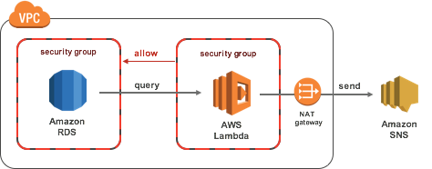

# Overview



# Requirements

* `Private Subnet`
* Allocate `NatGateway` to `Private Subnet` and set `RouteTable` 
* RDS
* `Security Group` For RDS Access  (e.g. sg_lambda_rds_access)
* Allow RDS Access `Security Group` for RDS security 
* SNS Topic

# Properties

* see serverless.yml
	* functions.notify.events.schedule.rate: cron(YOUR_SCHEDULE)
	* functions.notify.vpc.securityGroupIds: YOUR_LAMBDAS_SECURITY_GROUP
	* functions.notify.vpc.subnetIds: YOUR_LAMBDAS_SUBNET_ID
	* functions.notify.environment.RDS_ENDPOINT: YOUR_RDS_ENDPOINT
	* functions.notify.environment.RDS_DATABESNAME: YOUR_RDS_DATABESNAME
	* functions.notify.environment.RDS_USERNAME: YOUR_RDS_USERNAME
	* functions.notify.environment.RDS_PASSWORD: YOUR_RDS_PASSWORD
	* functions.notify.environment.SNS_TOPIC: YOUR_SNS_TOPIC
	* functions.notify.environment.SNS_SUBJECT: "YOUR_SNS_SUBJECT"

# Customize query

* mod query.sql

## e.g.

	SELECT * 
	FROM customer
	WHERE create_date > DATE_SUB(CURRENT_DATE(), INTERVAL 1 DAY);

# Deploy

	mvn clean package
	sls deploy --region YOUR_REGION

	e.g. sls deploy --region ap-northeast-1

# Invoke

	sls invoke -f notify --region YOUR_REGION


# e.g.
## maven build
```
$mvn clean package
[INFO] Scanning for projects...
[INFO]
[INFO] ------------------------------------------------------------------------
[INFO] Building notification-query 1.0.0
[INFO] ------------------------------------------------------------------------
[INFO]
[INFO] --- maven-clean-plugin:2.6.1:clean (default-clean) @ notification-query ---
～～～～～～
[INFO] Attaching shaded artifact.
[INFO] ------------------------------------------------------------------------
[INFO] BUILD SUCCESS
[INFO] ------------------------------------------------------------------------
[INFO] Total time: 11.371 s
[INFO] Finished at: 2018-02-01T13:56:08+09:00
[INFO] Final Memory: 43M/432M
[INFO] ------------------------------------------------------------------------

$
```
## serverless deploy
```
$sls deploy --region ap-northeast-1
Serverless: Packaging service...
Serverless: Uploading CloudFormation file to S3...
Serverless: Uploading artifacts...
Serverless: Validating template...
Serverless: Updating Stack...
Serverless: Checking Stack update progress...
.........
Serverless: Stack update finished...
Service Information
service: notification-query
stage: dev
region: ap-northeast-1
stack: notification-query-dev
api keys:
  None
endpoints:
  None
functions:
  notify: notification-query-dev-notify

$
```
## Invoke
```
$sls invoke -f notify --region ap-northeast-1
{
    // Output query Result 
}

$
```